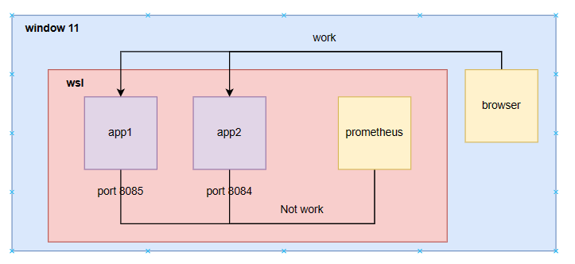

# prometheus grafana springboot run

> Không thể test phần prometheus grafana lúc chạy sử dụng material compose

> 👉 mô tả    
Sử dụng wsl để code + deploy   
prometheus config sử dụng host.docker.internal nhưng vẫn không thể thay thế localhost    
prometheus vẫn không thể truy cập vào service/actuator/prometheus để lấy log  

=> nhưng deploy containerzation app vẫn chạy bình thường
